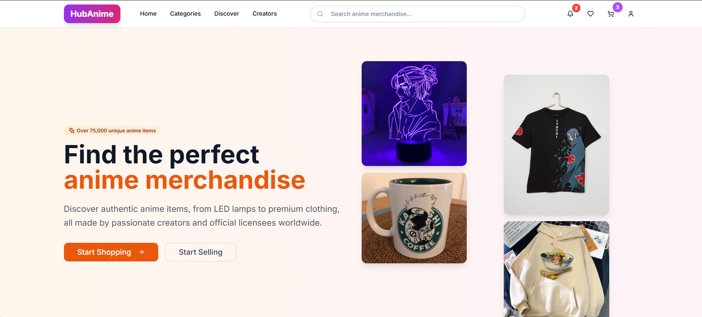

  
  
  # 🎌 HubAnime - Premium Anime Marketplace
  
  **Your ultimate destination for authentic anime merchandise from creators worldwide**
  
  
  
  
  
  [🚀 Live Demo](https://hubanime.vercel.app) • [📖 Docs](https://github.com/AaYuSh11233/HubAnime/wiki) • [🐛 Issues](https://github.com/AaYuSh11233/HubAnime/issues)

---

## 🎯 About The Project

HubAnime is a modern e-commerce platform for anime merchandise, connecting fans with authentic products from creators worldwide. Built with Next.js 15, TypeScript, and Tailwind CSS for a lightning-fast, responsive experience.

### ✨ Key Features

- **🛍️ Complete E-commerce** - Product catalog, cart, checkout, and order tracking
- **🎨 Modern UI/UX** - Responsive design with smooth Framer Motion animations
- **🏪 Creator Marketplace** - Support independent artists and official licensees
- **🔍 Advanced Search** - Smart filtering by series, category, and price
- **🔒 Secure & Fast** - SSL encryption, optimized performance, and SEO-ready

---

## 🛠️ Tech Stack

- **Frontend**: Next.js 15, React 18, TypeScript
- **Styling**: Tailwind CSS, shadcn/ui, Framer Motion
- **Tools**: ESLint, Prettier, Vercel deployment
- **Icons**: Lucide React

---

## 🚀 Quick Start

### Prerequisites
- Node.js 18.18+
- npm/yarn/pnpm/bun

### Installation

\`\`\`bash
# Clone the repository
git clone https://github.com/AaYuSh11233/HubAnime.git
cd HubAnime

# Install dependencies
npm install

# Set up environment variables
cp .env.example .env.local
# Edit .env.local with your configuration

# Run development server
npm run dev
\`\`\`

Open [http://localhost:3000](http://localhost:3000) in your browser.

### Build for Production

\`\`\`bash
npm run build
npm start
\`\`\`

---

## 🗺️ Roadmap

### ✅ Phase 1 - Core Features
- [x] Product catalog and search
- [x] Shopping cart functionality  
- [x] User authentication
- [x] Responsive design

### 🚧 Phase 2 - Enhanced Features
- [ ] Payment integration (Stripe)
- [ ] Order management system
- [ ] Seller dashboard
- [ ] Product reviews and ratings

### 📋 Phase 3 - Advanced Features
- [ ] Real-time notifications
- [ ] Wishlist functionality
- [ ] AI-powered recommendations
- [ ] Mobile app

---

## 🤝 Contributing

Contributions are welcome! Please feel free to submit a Pull Request.

1. Fork the project
2. Create your feature branch (`git checkout -b feature/AmazingFeature`)
3. Commit your changes (`git commit -m 'Add AmazingFeature'`)
4. Push to the branch (`git push origin feature/AmazingFeature`)
5. Open a Pull Request

---

## 📄 License

Distributed under the MIT License. See `LICENSE` for more information.

---

## 📞 Contact

**Maintainer**: [AaYuSh11233](https://github.com/AaYuSh11233)

- **GitHub**: [@AaYuSh11233](https://github.com/AaYuSh11233)
- **Project**: [https://github.com/AaYuSh11233/HubAnime](https://github.com/AaYuSh11233/HubAnime)

---

## 🙏 Acknowledgments

- [Next.js](https://nextjs.org/) - React framework
- [Tailwind CSS](https://tailwindcss.com/) - CSS framework
- [shadcn/ui](https://ui.shadcn.com/) - UI components
- [Vercel](https://vercel.com/) - Deployment platform

---

  
### 🌟 Star this repository if you found it helpful!

**Made with ❤️ for the anime community**

